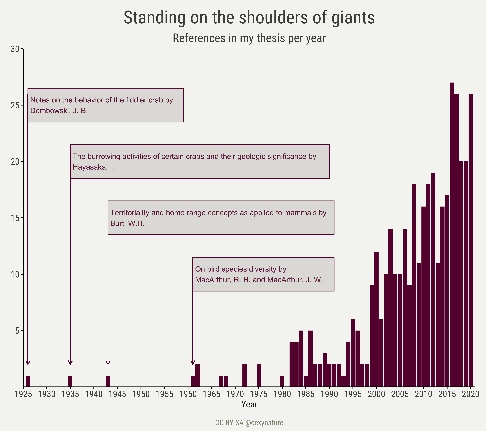

Standing on the shoulders of giants:
a visual thread of the references in my PhD thesis.

==============

My thesis is about improving the way we monitor biodiversity, getting more and better data. I used intertidal crabs as my study system, and video surveys and computer vision as tools of my trade. 

As any scientific enterprise, mine is built on the contributions of many people. Here is a thread about the influential literature in my thesis.

No surprisingly most of the 406 works I cited are from “traditional” journals. I read a lot of papers from Computer Vision conferences, I thought conferences papers would be more numerous, I guess not all papers I read made it into the thesis.

The oldest citation in my thesis is almost a 100 years old. But most than 80% of the references are from the last 20 years.

I am not shocked with the top most cited journals, but I am surprised with the order in which they are. Never thought that JEMBE and MEPS were the most cited, but happy that these were. I really enjoy manuscripts from these journals (likely implicit bias).
 

I cited over 1200 authors. Pinpoint the exact number is difficult given discrepancies in author’s name across publications. Unreal ORCID is not yet fully embraced. Most cited author was my advisor (16, not shown in the figure below), whom by the way never suggested to include his work in my thesis

I would like to visualize the literature I have cited per access type (pay per view, subscription, green, bronze or gold open access, etc). But I do not know how to get this data per journal. Any ideas about a journal database that I could use to programmatically query journals’ publishing mode/type?

A twitter thread with these figures can be found [here](https://twitter.com/CexyNature/status/1367367274357686274?s=20).
